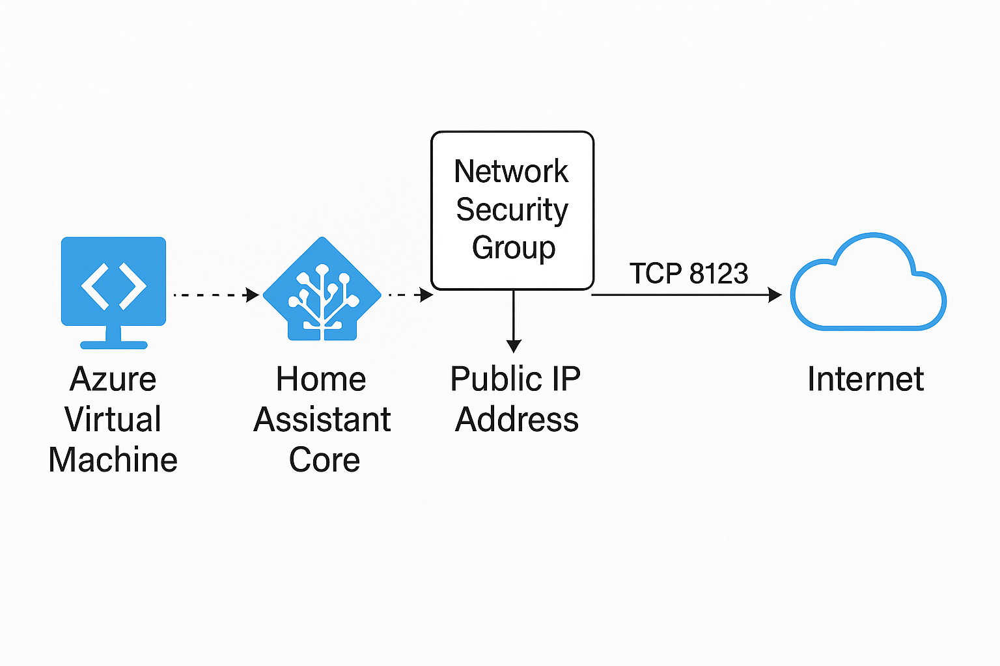

# Hosting Home Assistant on Azure VM

## Overview
To prepare for potential natural disasters and local power failures, I deployed Home Assistant on an Azure Virtual Machine.

This setup ensures that smart home automations remain accessible from anywhere, even if the home network is down or local hardware is damaged.

## Motivation
Running Home Assistant locally can create a single point of failure—especially during emergencies like storms, power outages, or hardware issues.

By hosting it on Azure, I ensured continuous uptime and access to smart home controls from any location, including mobile or temporary housing during disruptions.

## Architecture

## Architecture 
